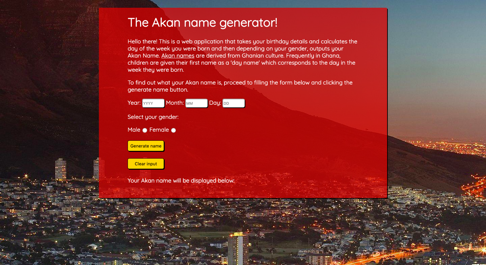
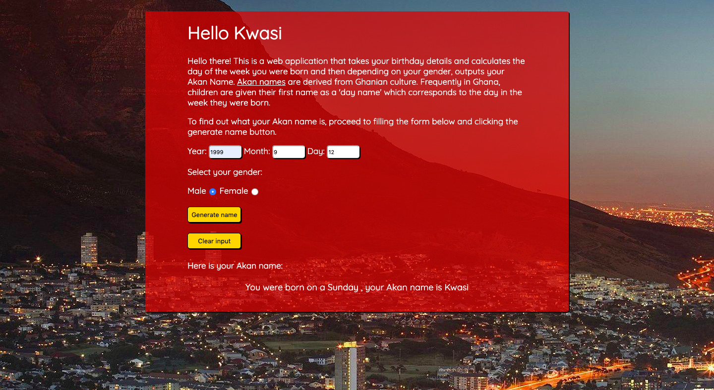

# Akan name generator
#### Simple web app that generates an Akan name based on the date of birth and gender by determining the day one was born, 14/8/2019

## Author
Collins Muriuki

## Versioning
Akan name generator V1.1

## Description
Akan names are derived from Ghanian culture. Frequently in Ghana, children are given their first name as a 'day name' which corresponds to the day in the week they were born. Here are Ghanian day names. This app takes a user's birthday on the form provided and calculates the day of the week they were born and then depending on their gender outputs their Akan Name.
This app will take in a user's year of birth, month of birth, day of birth and select gender. Using a formula assigned to a variable in the akan.js file (dayOfWeekNumber), it will be possible to determine the exact day of the week the user was born and give them an Akan name based on their gender.

## Features
Here are the features in summary:
* Input of year of birth.
* Input month of birth.
* Input day of birth.
* Select Gender.
* Output Akan name.

## Installation and Set-up
To view the app, open the Github Pages link provided below on the README.
Here is a run through of how to set up the application
* Step 1 : Clone this repository using **`git clone https://github.com/collinsmuriuki/akan-name-generataor.git`**, or downloading a ZIP file of the code.
* Step 2 : The repository, if downloaded as a .zip file will need to be extracted o your preferred location and opened
* Step 3 : Open the index.html file to view the application on your preferred web browser

## Known Bugs
* Formula provided to determine day of birth shows inconsistency in its results (Bug fixed)
## Technologies Used
* HTML  
* CSS
* Javascript

## Support and contact details
You can provide feedback or raise any issues/ bugs through the following means:
* murerwacollins@gmail.com
* Slack me (Moringa-School)  @CM Collins Muriuki

## Github Pages link
You can view the live application by following this link https://collinsmuriuki.github.io/akan-name-generataor/

## License
#### *MIT License*
The MIT License

Permission is hereby granted, free of charge, to any person obtaining a copy
of this software and associated documentation files (the "Software"), to deal
in the Software without restriction, including without limitation the rights
to use, copy, modify, merge, publish, distribute, sublicense, and/or sell
copies of the Software, and to permit persons to whom the Software is
furnished to do so, subject to the following conditions:

The above copyright notice and this permission notice shall be included in
all copies or substantial portions of the Software.

THE SOFTWARE IS PROVIDED "AS IS", WITHOUT WARRANTY OF ANY KIND, EXPRESS OR
IMPLIED, INCLUDING BUT NOT LIMITED TO THE WARRANTIES OF MERCHANTABILITY,
FITNESS FOR A PARTICULAR PURPOSE AND NONINFRINGEMENT. IN NO EVENT SHALL THE
AUTHORS OR COPYRIGHT HOLDERS BE LIABLE FOR ANY CLAIM, DAMAGES OR OTHER
LIABILITY, WHETHER IN AN ACTION OF CONTRACT, TORT OR OTHERWISE, ARISING FROM,
OUT OF OR IN CONNECTION WITH THE SOFTWARE OR THE USE OR OTHER DEALINGS IN
THE SOFTWARE.
Copyright (c) 2019 **Collins Muriuki**
